# 🎵 Real Legacy Media - All Your Favourite Music In Any Format...

## 🔗 Live Project

- 🌍 Live Site: [Real Legacy Media](https://reallegacymedia-prod.onrender.com)
- 💻 GitHub Repo: [Full Stack E-Commerce Wensbite](https://github.com/TylerRTDev/CI-MSProject4)

## Table of Contents

- [📦 Project Overview](#-project-overview)
- [💡 Rationale](#-rationale)
- [🎯 Project Objectives](#-project-objectives)
- [🎯 Target Audience](#-target-audience)
- [🎨 Design Choices](#-design-choices)
  - [🗂️ Wireframes/Designs](#️-wireframesdesigns)
  - [🔤 Typography](#-typography)
- [👥 User Stories](#-user-stories)
- [🌟 Key Features](#-key-features)
- [📊 Entity Relationship Diagram (ERD)](#-entity-relationship-diagram-erd)
- [🧱 Tables & Fields](#-tables--fields)
- [🚀 Getting Started](#-getting-started)
- [🛠️ Technologies Used](#️-technologies-used)
- [📚 Usage Instructions](#-usage-instructions)
- [🧪 Testing and Deployment](#-testing-and-deployment)
- [🐞 Known Issues & Future Improvements](#-known-issues--future-improvements)


## 📦 Project Overview

Welcome to **Real Legacy Media**, a full-stack Django-powered e-commerce platform built for music lovers, collectors, and creators. Whether you're hunting for rare vinyl, stocking up on CDs, or browsing for digital downloads and exclusive merchandise, this app lets you do it all in a streamlined, stylish, and secure environment.

Designed to feel like a record store reimagined for the web, Real Legacy Media supports a smooth customer experience and includes powerful administrative tools for managing inventory, users, and orders. From casual visitors to returning shoppers and site admins, every user role is thoughtfully supported.

---

## 💡 Rationale

Music is timeless—but the way people discover and purchase it is constantly evolving. Real Legacy Media taps into the resurgence of physical music formats, while offering the convenience of a modern online storefront. The project was born from a desire to:

* Blend the nostalgic appeal of record shops with modern UX/UI practices
* Create a community-focused platform that supports browsing, reviewing, and collecting
* Provide admin-level control without compromising frontend design or user experience

---

## 🎯 Project Objectives

The goal of Real Legacy Media is to build a robust, full-stack e-commerce platform using Django that celebrates the enduring legacy of music across physical formats. The site aims to combine functionality with a retro-modern aesthetic that resonates with both seasoned collectors and new fans alike.

Core objectives include:

* Providing a mobile-first, responsive storefront for browsing and buying media
* Supporting user authentication, including profile management and order history
* Offering product filtering, sorting, and search tools to enhance discoverability
* Enabling secure checkout with Stripe integration and guest checkout support
* Highlighting curated collections and media types (vinyl, CD, digital, merch)
* Creating a clean, retro-inspired UI that reflects the spirit of legacy music
* Ensuring scalability for future additions such as reviews, wishlists, or forums

Ultimately, this project blends modern development practices with timeless cultural value—positioning Real Legacy Media as a go-to destination for music media shopping online.

---

## 🎯 Target Audience

Real Legacy Media is designed for music lovers, collectors, and nostalgic audiences who value the tangible experience of physical media in a digital age. The platform caters to individuals aged 25–60 who appreciate vinyl records, CDs, and limited-edition merchandise tied to classic and contemporary music culture. This includes:

* Collectors seeking rare pressings or exclusive drops
* Audiophiles who prefer high-fidelity analog formats

* Fans of specific genres or eras looking for curated selections

* Gifting audiences interested in unique, meaningful music-based gifts

* Casual listeners transitioning into deeper music appreciation

The platform also appeals to shoppers who want a personalized and aesthetic experience—one that feels premium, retro-inspired, and aligned with the timelessness of music.

---

## 👥 User Goals

- Browse and discover music products by genre, media type, or category
- Add products to their cart and adjust quantities as needed
- Purchase items securely using a fast and seamless checkout flow
- Track their orders and view past purchase history
- Navigate the site smoothly across both desktop and mobile devices
- Enjoy a visually rich, retro-inspired experience without compromising usability

---

## 💡 User Value

- 🎵 **Diverse product formats** — Users can shop vinyl, CDs, and digital media with clear format labeling and filtering.
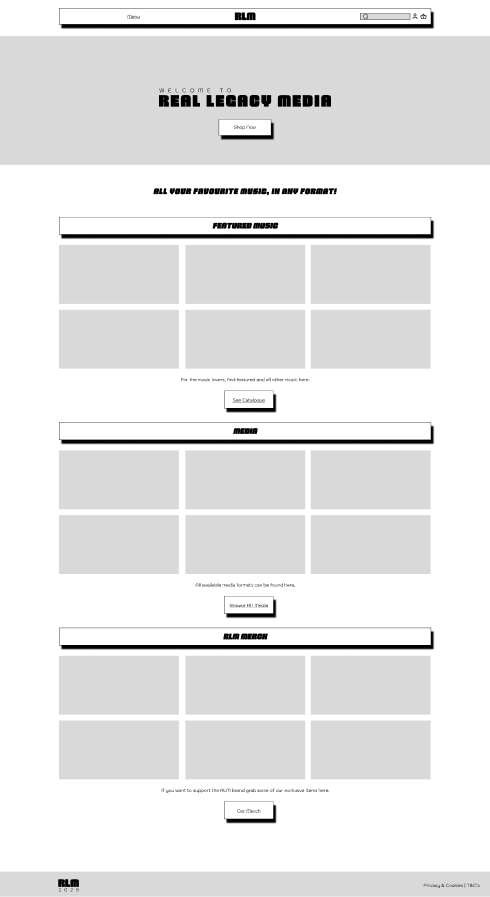

- 📱 **Mobile-first design** — The entire shopping experience is optimized for small screens, ensuring accessibility on the go.


- 🛒 **Session-based cart** — Cart contents persist between visits for logged-in users, enabling easy product tracking.


- 💳 **Secure Stripe checkout** — Users complete purchases through Stripe’s trusted payment gateway with minimal friction.


- 📦 **Order tracking** — Users receive confirmation and status updates, and can access their past orders from their profile.


- ⚡ **Fast, intuitive UI** — UI components are designed for minimal load times and responsive feedback for all actions.


- 🧾 **Simple account management** — Profiles are easy to edit and allow storage of personal preferences and delivery details.


> These features collectively support a user experience that’s fast, flexible, and aligned with the expectations of modern online shoppers — especially those passionate about curated physical media.

---

## 🎨 Design Choices

The visual identity of Real Legacy Media is rooted in a retro aesthetic with some modern elements that pays homage to the golden age of physical music formats while remaining accessible and relevant for today’s digital users.

### Colour Scheme

The color palette combines warm, earthy tones with vintage appeal:

* #A86523 (brown) evokes classic record sleeves and aged materials

* #E9A319 (orange) and #FAD59A (peach) add nostalgic vibrance reminiscent of 70s–90s design motifs

* #FCEFCB (cream) softens the interface with a mellow background warmth

* #000000 (black) is used for text and contrast, grounding the aesthetic in simplicity and readability

This palette creates a clean, inviting visual hierarchy that avoids clutter and encourages browsing. Typography choices favor blocky, geometric fonts reminiscent of vintage album covers and arcade-era displays, while layouts are grid-based and responsive — designed to scale smoothly across breakpoints (mobile, tablet, desktop).

Additional design principles include:

* Functional retro: Elements like badges, buttons, and cards carry subtle nods to older interfaces but are built with modern CSS and UX patterns
* Consistent theming: Every UI element—from product cards to navigation bars—uses a cohesive visual style to reinforce brand identity

Together, these design choices create a shopping experience that feels nostalgic yet modern, appealing to users who value both the past and present of music culture.

### 🗂️ Wireframes/Designs

The wireframes for Real Legacy Media were created with a **mobile-first design strategy** in mind. These initial concepts focused on structuring core user flows — such as browsing products, navigating categories, and completing checkout — on small screens first, ensuring a responsive and accessible experience across all devices.

Each wireframe served as a foundational blueprint that guided the visual hierarchy, layout decisions, and component placement in the final UI. While the designs evolved through iteration and styling, the wireframes played a key role in shaping the overall structure and functionality of the finished site.

<details>
<summary>Wireframes</summary>
<br>

#### Homepage
Desktop - 1440px


Tablet - 768px
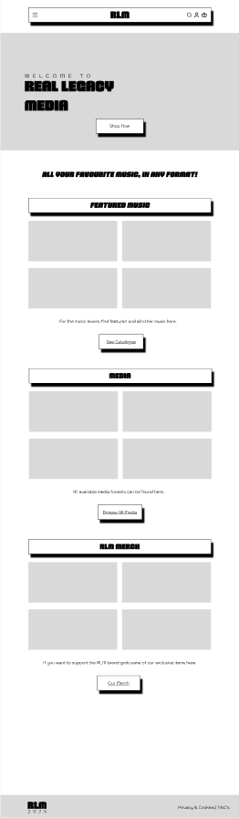

Mobile - 360px
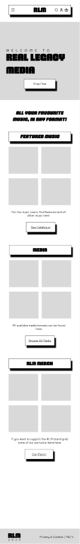

#### Login & Register
Account Login Form
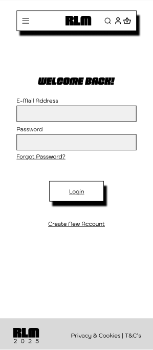

Account Registration Form
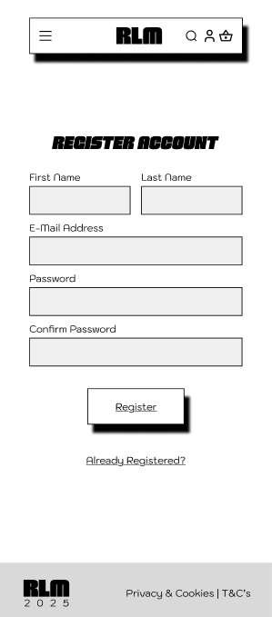

#### User Account
Account Dashboard
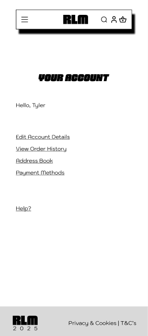

User Account Details
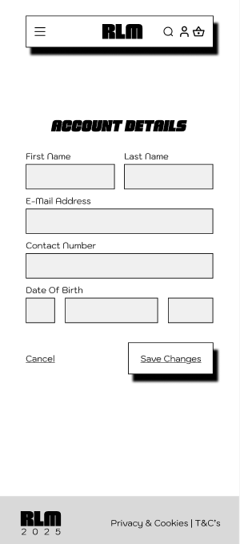

User Order History
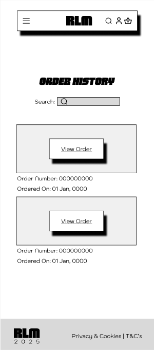

User Order Details
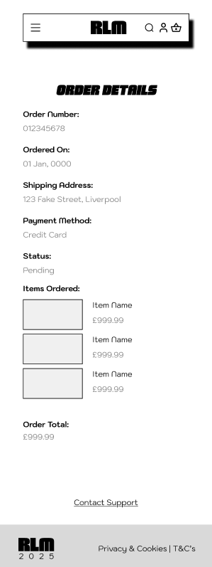

#### Checkout
Checkout Order Form
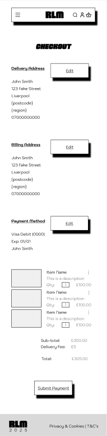

#### Cart
Populated Cart
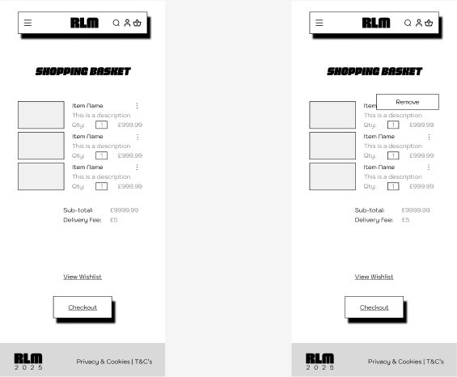

Empty Cart
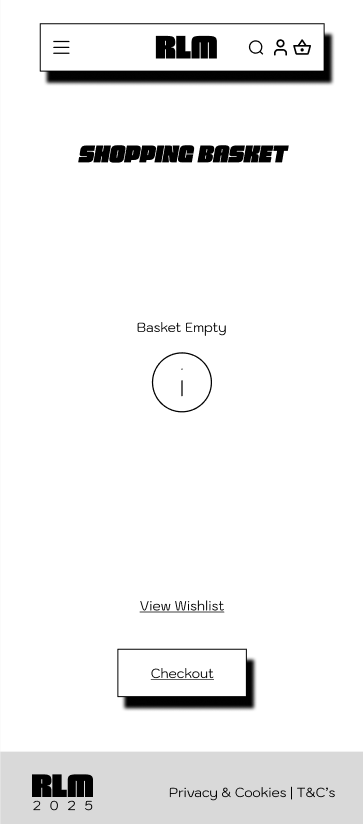

#### Product List
Product Catalogue
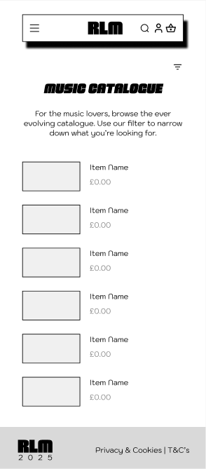

Product For Sale
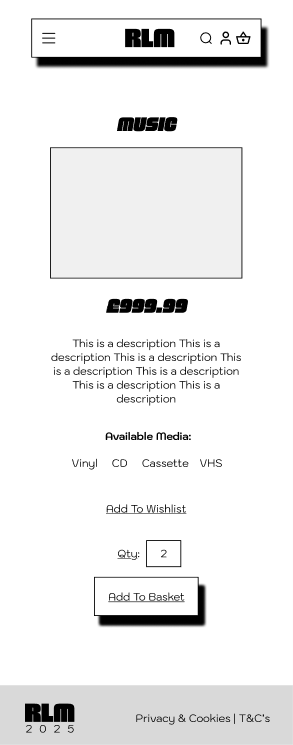


</details>

---

### 🔤 Typography

The typography for Real Legacy Media was chosen to evoke a blend of retro style and modern readability — reflecting the brand’s focus on nostalgic physical media with a contemporary digital experience.

#### 🎵 Headings: `Brexon`
Brexon is a bold, geometric typeface used for headings, titles, and product names. Its sharp angles and blocky proportions convey a vintage poster feel, aligning with the brand’s retro music aesthetic. This choice reinforces the site's strong visual identity and helps key sections stand out.

### 📱 Headings (Mobile Fallback): `Sigmar One`
On mobile devices where `Brexon` may not load reliably, the site falls back to **Sigmar One**, a rounded display font. While visually distinct, it retains the playful, expressive energy of the brand and maintains visual hierarchy on smaller screens and aligns with the initial blocky/vintage style Brexon provides.

#### 🪄 Body Text: `Kodchasan`
Kodchasan - Used for product descriptions, is a clean, sans-serif font optimized for readability across screen sizes. It complements Brexon without competing with it, and provides a neutral, friendly tone for paragraphs, product descriptions, and UI elements.

Both fonts are used in **black** for maximum legibility against the site’s light and peach-toned backgrounds.

> Overall, the typography supports a cohesive user experience by balancing style with functionality — bold enough to make an impression, clear enough to shop with ease.

## 👥 User Stories

### 🎧 As a Music Fan (Site Visitor):

* You can browse music by genre, artist, or format.
* You can preview albums or tracks (if previews are enabled).
* You can view product details including images, pricing, and stock status.
* You can create an account to track orders and manage your information.

### 🛒 As a Returning Customer:

* You can log in to view your past orders.
* You can easily reorder previously purchased items.
* You can update your password and profile information.
* You can save favorite items to a wishlist (planned feature).

### 🧑‍💼 As a Site Admin:

* You can manage product listings, images, and stock levels.
* You can add and edit categories, genres, or media types.
* You can view and update customer orders and shipping details.
* You can mark items as "Featured" or "Limited Edition."

---

## 🌟 Key Features

* **Dynamic Product Catalogue**: View products by category, genre, and type with sorting and search filters.
* **User Authentication**: Secure sign-up, login, logout, and profile editing features.
* **Shopping Cart**: Add, update, and remove items in your cart. Select sizes/formats if applicable.
* **Order Management**: Logged-in users can view order summaries, track delivery status, and re-order items.
* **Stripe Checkout**: Integrated payment gateway using Stripe’s test mode for secure transactions.
* **Responsive Design**: Optimised for mobile, tablet, and desktop experiences.
* **Admin Dashboard**: Fully featured backend interface for managing products, orders, users, and site content.

---

## 📊 Entity Relationship Diagram (ERD)

The Real Legacy Media platform is structured using Django’s ORM and a fully normalized relational database. The schema is designed to support a digital storefront for physical and digital music products, with support for user management, cart handling, order processing, and Stripe-integrated checkout.

- **User Profiles:** Django’s built-in `User` model is extended via a `Profile` model using a one-to-one relationship. Profiles store personal information like address, country, contact number, date of birth, and musical preferences (`favorite_genre`).

- **Product Catalog:** Products are organized by `Category`, and also linked to a `Genre` (e.g., hip-hop, classical) and `MediaType` (e.g., vinyl, CD, digital download). Each `Product` includes price, stock level, sale information, and timestamp metadata. Associated images are stored in the `ProductImage` model, allowing for ordering and main image designation.

- **Shopping Cart:** The `CartItem` model acts as a many-to-many join between `User` and `Product`, storing the quantity selected. This allows users to maintain a session-based or persistent cart before purchasing.

- **Orders:** Once a user checks out, their items are stored in an `Order` model which tracks shipping details, status, and order totals. Each product purchased is saved in the related `OrderItem` model, capturing the quantity and price at the time of sale.

- **Checkout (Stripe Integration):** Stripe-driven payments are tracked using the `CheckoutOrder` model. This includes an `order_session` (Stripe session ID), a unique `order_number`, and a record of the user's name, email, address, total paid, and payment status. This model allows full decoupling of order creation from payment confirmation, improving payment integrity and security.

This ERD supports scalability, modular development, and seamless payment workflows, while maintaining clean separation of user data, catalog logic, and transactional records.


## 🧱 Tables & Fields

| Entity           | Field           | Type                  | Key | FK to        | Notes/Constraints                     |
|------------------|------------------|------------------------|-----|--------------|--------------------------------------|
| **Profile**       | user             | OneToOneField          | FK  | User.id      | on_delete=CASCADE, unique            |
|                  | phone            | CharField              |     |              | blank=True                           |
|                  | address          | TextField              |     |              | blank=True                           |
|                  | city             | CharField              |     |              | blank=True                           |
|                  | country          | CharField              |     |              | blank=True                           |
|                  | date_of_birth    | DateField              |     |              | null=True, blank=True                |
|                  | favorite_genre   | CharField              |     |              | blank=True                           |
|                  | created_at       | DateTimeField          |     |              | auto_now_add=True                    |
| **Genre**         | name             | CharField              |     |              |                                      |
|                  | slug             | SlugField              |     |              | unique=True                          |
| **MediaType**     | name             | CharField              |     |              |                                      |
|                  | slug             | SlugField              |     |              | unique=True                          |
| **Category**      | name             | CharField              |     |              |                                      |
|                  | slug             | SlugField              |     |              | unique=True                          |
| **Product**       | name             | CharField              |     |              |                                      |
|                  | slug             | SlugField              |     |              | unique=True                          |
|                  | description      | TextField              |     |              |                                      |
|                  | price            | DecimalField(10,2)     |     |              |                                      |
|                  | original_price   | DecimalField(10,2)     |     |              | nullable                             |
|                  | stock            | PositiveIntegerField   |     |              |                                      |
|                  | is_featured      | BooleanField           |     |              |                                      |
|                  | created_at       | DateTimeField          |     |              | auto_now_add=True                    |
|                  | updated_at       | DateTimeField          |     |              | auto_now=True                        |
|                  | genre            | ForeignKey             | FK  | Genre.id     | on_delete=SET_NULL, null=True        |
|                  | media_type       | ForeignKey             | FK  | MediaType.id | on_delete=SET_NULL, null=True        |
|                  | category         | ForeignKey             | FK  | Category.id  | on_delete=SET_NULL, null=True        |
| **ProductImage**  | product          | ForeignKey             | FK  | Product.id   | on_delete=CASCADE                    |
|                  | image            | ImageField             |     |              |                                      |
|                  | alt_text         | CharField              |     |              | blank=True                           |
|                  | is_main          | BooleanField           |     |              |                                      |
|                  | order            | PositiveIntegerField   |     |              |                                      |
| **CartItem**      | user             | ForeignKey             | FK  | User.id      | on_delete=CASCADE                    |
|                  | product          | ForeignKey             | FK  | Product.id   | on_delete=CASCADE                    |
|                  | quantity         | PositiveIntegerField   |     |              | default=1                            |
| **Order**         | user             | ForeignKey             | FK  | User.id      | on_delete=CASCADE, nullable          |
|                  | email            | EmailField             |     |              | nullable                             |
|                  | address          | TextField              |     |              | nullable                             |
|                  | city             | CharField              |     |              | nullable                             |
|                  | postcode         | CharField              |     |              | nullable                             |
|                  | total_amount     | DecimalField(10,2)     |     |              |                                      |
|                  | status           | CharField              |     |              | choices=[Pending, Shipped, Delivered]|
|                  | created_at       | DateTimeField          |     |              | auto_now_add=True                    |
| **OrderItem**     | order            | ForeignKey             | FK  | Order.id     | on_delete=CASCADE                    |
|                  | product          | ForeignKey             | FK  | Product.id   | on_delete=CASCADE                    |
|                  | quantity         | PositiveIntegerField   |     |              |                                      |
|                  | price            | DecimalField(10,2)     |     |              |                                      |
| **CheckoutOrder** | user             | ForeignKey             | FK  | User.id      | on_delete=CASCADE, nullable          |
|                  | order_session    | CharField              |     |              | unique=True, nullable                |
|                  | order_number     | CharField              |     |              | unique=True, nullable                |
|                  | email            | EmailField             |     |              | nullable                             |
|                  | full_name        | CharField              |     |              |                                      |
|                  | city             | CharField              |     |              | nullable                             |
|                  | postcode         | CharField              |     |              | nullable                             |
|                  | total_amount     | DecimalField(10,2)     |     |              |                                      |
|                  | status           | CharField              |     |              | choices=[pending, shipped, delivered]|
|                  | created_at       | DateTimeField          |     |              | auto_now_add=True                    |

> The following table represents the project’s Entity Relationship Diagram (ERD) in tabular form, outlining all models, fields, keys, and relationships used in the Real Legacy Media database schema.


## 🚀 Getting Started

To run this project locally, follow the steps below. These instructions assume you're using Python 3.10+ and have `pip` and `git` installed.

### 🔧 Prerequisites

* Python 3.10+
* pip
* Git
* Virtual environment tool (e.g., `venv` or `virtualenv`)
* \[Optional] PostgreSQL for production use

### 📦 Installation Steps

1. **Clone the repository**

```bash
git clone https://github.com/TylerRTDev/CI-MSProject4.git
cd CI-MSProject4
```

2. **Create and activate a virtual environment**

```bash
python -m venv venv
source venv/bin/activate  # On Windows: venv\Scripts\activate
```

3. **Install dependencies**

```bash
pip install -r requirements.txt
```

4. **Set up environment variables**
   Create a `.env` file in the root directory with the following keys:

```
SECRET_KEY=your_django_secret_key
STRIPE_PUBLISHABLE_KEY=your_stripe_test_key
STRIPE_SECRET_KEY=your_stripe_secret_key
STRIPE_WEBHOOK_SECRET=your_webhook_secret_key
DEBUG=True
```

5. **Apply database migrations**

```bash
python manage.py migrate
```

6. **Create a superuser for admin access**

```bash
python manage.py createsuperuser
```

7. **Run the development server**

```bash
python manage.py runserver
```

Visit `http://127.0.0.1:8000/` in your browser to view the site.

---

## 🛠️ Technologies Used

### 💻 Backend

* Django 4.x (Python Web Framework)
* SQLite (default development DB)
* PostgreSQL (recommended for production)
* Python Decouple (for environment variable management)

### 🎨 Frontend

* Django Templates
* Bootstrap 5 (Responsive CSS Framework)
* Custom CSS and JavaScript enhancements

### 🧾 Payments & Accounts

* Stripe API (sandbox test mode enabled)
* Django’s built-in auth system (login, logout, password change)

### ⚙️ Tooling & Deployment

* Git & GitHub for version control
* Render.com (for deployment)
* Pillow (for image upload handling)
* Crispy Forms + Bootstrap 5 for styled form rendering

---

## 📚 Usage Instructions

### For Shoppers

* **Browse** music by category, genre, or type using the top navigation or filters.
* **View product details** including title, format, pricing, availability, and description.
* **Add to Cart**: Choose the format or size, then add the item to your cart.
* **Checkout**: Review cart items and complete payment securely via Stripe.
* **Order History**: Log in to view all your past purchases and order details.
* **Profile Management**: Update your personal details, address, and contact info.

### For Admins

* **Access Django Admin** via `/admin/` with your superuser credentials.
* **Manage Products**: Add/edit/delete items, upload images, set stock levels.
* **Track Orders**: Update order status (e.g., pending, shipped, delivered).
* **User & Category Management**: Edit user profiles, create new genres or categories.

---

## 🧪 Testing and Deployment

### ✅ Testing

Testing includes both automated and manual verification across key user workflows.

* **Unit Tests**: Run with Django’s built-in test suite:

```bash
python manage.py test
```

* **Manual Testing**: Performed on:

  * User registration and login
  * Cart interactions (add/update/remove)
  * Order placement and confirmation
  * Admin views and CRUD operations
  * Mobile and tablet responsiveness

> Using tools like Postman for API endpoint validation or pytest for extended test coverage.

### 🚀 Deployment

The app is deployed to [Render](https://render.com/) with the following setup:

* **Web Server**: Gunicorn (or `manage.py runserver` for dev)
* **Environment Variables**: Managed via `.env` (in development) and dashboard settings in Render
* **Database**: SQLite in development; PostgreSQL or other production-ready DB recommended
* **Static/Media Files**:

  ```bash
  python manage.py collectstatic
  ```
* **Domains & HTTPS**: Use Render’s domain setup or custom domain configuration for production readiness

---

## 🐞 Known Issues & Future Improvements

While the core features of Real Legacy Media are fully functional, the following improvements and features are planned:

* 🧾 **Coupon Support**: Backend model and checkout logic for promotional discounts.
* 💖 **Wishlist System**: Model exists but frontend logic is incomplete (planned for Phase 2).
* 🔊 **Audio Previews**: HTML5 player integration for music sample previews.
* 🔔 **Email Notifications**: Order confirmation and shipping updates via email (currently console-based).
* 🧑‍🤝‍🧑 **Subscriptions & Rewards**: Membership plans, exclusive drops, and subscriber perks.
* 🔍 **Enhanced Search & Filtering**: More granular filtering by artist, format, price range.
* 📱 **Progressive Web App Support**: For an installable, app-like experience.

If you're interested in contributing to these features, see the Contributing section.

---
