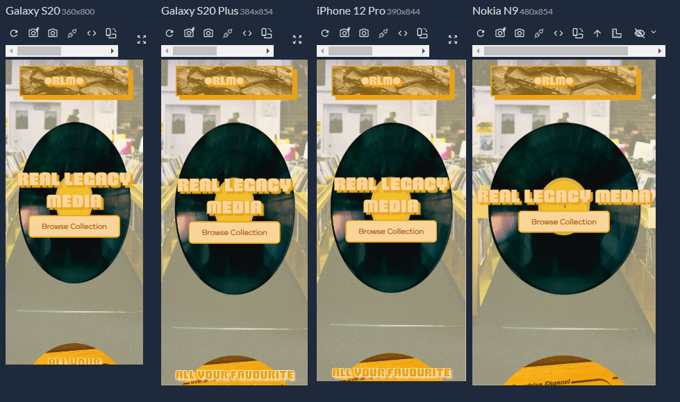
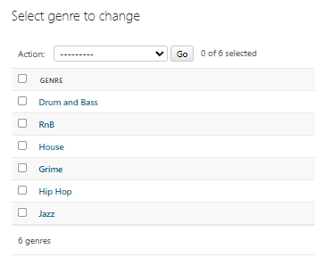

# 🎵 Real Legacy Media - All Your Favourite Music In Any Format...

## 🔗 Live Project

- 🌍 Live Site: [Real Legacy Media](https://reallegacymedia-prod.onrender.com)
- 💻 GitHub Repo: [Full Stack E-Commerce Website Project](https://github.com/TylerRTDev/CI-MSProject4)

## Table of Contents

- [📦 Project Overview](#-project-overview)
- [💡 Rationale](#-rationale)
- [🎯 Project Objectives](#-project-objectives)
- [🎯 Target Audience](#-target-audience)
- [👥 User Goals](#-user-goals)
- [💡 User Value](#-user-value)
- [🎨 Design Choices](#-design-choices)
  - [Colour Scheme](#colour-scheme)
  - [🗂️ Wireframes/Designs](#️-wireframesdesigns)
  - [🔤 Typography](#-typography)
- [👥 User Stories](#-user-stories)
  - [🎧 As a Music Fan (Site Visitor)](#-as-a-music-fan-site-visitor)
  - [🛒 As a Returning Customer](#-as-a-returning-customer)
  - [🧑‍💼 As a Site Admin](#-as-a-site-admin)
- [🌟 Key Features](#-key-features)
- [📊 Entity Relationship Diagram (ERD)](#-entity-relationship-diagram-erd)
- [🗂️ Database Schema](#️-database-schema)
- [🛠️ Technologies Used](#️-technologies-used)
  - [💻 Backend](#-backend)
  - [🎨 Frontend](#-frontend)
  - [🧾 Payments & Accounts](#-payments--accounts)
  - [⚙️ Tooling & Deployment](#️-tooling--deployment)
- [📚 Usage Instructions](#-usage-instructions)
- [🚀 Getting Started](#-getting-started)
- [🚀 Deployment](#-deployment)
  - [📂 Version Control](#-version-control)
  - [🛠 Local Deployment](#-local-deployment)
  - [☁️ Render Deployment](#️-render-deployment)
- [🐞 Known Issues & Future Improvements](#-known-issues--future-improvements)


## 📦 Project Overview

Welcome to **Real Legacy Media**, a full-stack Django-powered e-commerce platform built for music lovers, collectors, and creators. Whether you're hunting for rare vinyl, stocking up on CDs, or browsing for digital downloads and exclusive merchandise, this app lets you do it all in a streamlined, stylish, and secure environment.

Designed to feel like a record store reimagined for the web, Real Legacy Media supports a smooth customer experience and includes powerful administrative tools for managing inventory, users, and orders. From casual visitors to returning shoppers and site admins, every user role is thoughtfully supported.

---

## 💡 Rationale

Music is timeless—but the way people discover and purchase it is constantly evolving. Real Legacy Media taps into the resurgence of physical music formats, while offering the convenience of a modern online storefront. The project was born from a desire to:

* Blend the nostalgic appeal of record shops with modern UX/UI practices
* Create a community-focused platform that supports browsing and collecting
* Provide admin-level control without compromising frontend design or user experience

---

## 🎯 Project Objectives

The goal of Real Legacy Media is to build a robust, full-stack e-commerce platform using Django that celebrates the enduring legacy of music across physical formats. The site aims to combine functionality with a retro-modern aesthetic that resonates with both seasoned collectors and new fans alike.

Core objectives include:

* Providing a mobile-first, responsive storefront for browsing and buying media
* Supporting user authentication, including profile management and order history
* Offering product filtering, sorting, and search tools to enhance discoverability
* Enabling secure checkout with Stripe integration and guest checkout support
* Highlighting curated collections and media types (vinyl, CD, digital, merch)
* Creating a clean, retro-inspired UI that reflects the spirit of legacy music
* Ensuring scalability for future additions such as reviews, wishlists, or forums

Ultimately, this project blends modern development practices with timeless cultural value—positioning Real Legacy Media as a go-to destination for music media shopping online.

---

## 🎯 Target Audience

Real Legacy Media is designed for music lovers, collectors, and nostalgic audiences who value the tangible experience of physical media in a digital age. The platform caters to individuals aged 25–60 who appreciate vinyl records, CDs, and limited-edition merchandise tied to classic and contemporary music culture. This includes:

* Collectors seeking rare pressings or exclusive drops
* Audiophiles who prefer high-fidelity analog formats

* Fans of specific genres or eras looking for curated selections

* Gifting audiences interested in unique, meaningful music-based gifts

* Casual listeners transitioning into deeper music appreciation

The platform also appeals to shoppers who want a personalized and aesthetic experience—one that feels premium, retro-inspired, and aligned with the timelessness of music.

---

## 👥 User Goals

- Browse and discover music products by genre, media type, or category
- Add products to their cart and adjust quantities as needed
- Purchase items securely using a fast and seamless checkout flow
- Track their orders and view past purchase history
- Navigate the site smoothly across both desktop and mobile devices
- Enjoy a visually rich, retro-inspired experience without compromising usability

---

## 💡 User Value

- 🎵 **Diverse product formats** — Users can shop vinyl, CDs, and digital media with clear format labeling and filtering as well as site merchandise.


- 📱 **Mobile-first design** — The entire shopping experience is optimized for small screens, ensuring accessibility on the go.

[Responsivly App](https://responsively.app/)


- 🛒 **Session-based cart** — Cart contents persist between visits for logged-in users, enabling easy product tracking.


- 💳 **Secure Stripe checkout** — Users complete purchases through Stripe’s trusted payment gateway with minimal friction.


- 📦 **Order tracking** — Users receive confirmation and status updates, and can access their past orders from their profile.


- 🧾 **Simple account management** — Profiles are easy to edit and allow storage of personal preferences and delivery details.





> These features collectively support a user experience that’s fast, flexible, and aligned with the expectations of modern online shoppers — especially those passionate about curated physical media.

---

## 🎨 Design Choices

The visual identity of Real Legacy Media is rooted in a retro aesthetic with some modern elements that pays homage to the golden age of physical music formats while remaining accessible and relevant for today’s digital users.

### Colour Scheme

The color palette combines warm, earthy tones with vintage appeal:

* #A86523 (brown) evokes classic record sleeves and aged materials

* #E9A319 (orange) and #FAD59A (peach) add nostalgic vibrance reminiscent of 70s–90s design motifs

* #FCEFCB (cream) softens the interface with a mellow background warmth

* #000000 (black) is used for text and contrast, grounding the aesthetic in simplicity and readability

This palette creates a clean, inviting visual hierarchy that avoids clutter and encourages browsing. Typography choices favor blocky, geometric fonts reminiscent of vintage album covers and arcade-era displays, while layouts are grid-based and responsive — designed to scale smoothly across breakpoints (mobile, tablet, desktop).

Additional design principles include:

* Functional retro: Elements like badges, buttons, and cards carry subtle nods to older interfaces but are built with modern CSS and UX patterns
* Consistent theming: Every UI element—from product cards to navigation bars—uses a cohesive visual style to reinforce brand identity

Together, these design choices create a shopping experience that feels nostalgic yet modern, appealing to users who value both the past and present of music culture.

### 🗂️ Wireframes/Designs

The wireframes for Real Legacy Media were created with a **mobile-first design strategy** in mind. These initial concepts focused on structuring core user flows — such as browsing products, navigating categories, and completing checkout — on small screens first, ensuring a responsive and accessible experience across all devices.

Each wireframe served as a foundational blueprint that guided the visual hierarchy, layout decisions, and component placement in the final UI. While the designs evolved through iteration and styling, the wireframes played a key role in shaping the overall structure and functionality of the finished site.

<details>
<summary>Wireframes</summary>
<br>

#### Homepage
Desktop - 1440px


Tablet - 768px


Mobile - 360px


#### Login & Register
Account Login Form


Account Registration Form


#### User Account
Account Dashboard


User Account Details


User Order History


User Order Details


#### Checkout
Checkout Order Form


#### Cart
Populated Cart


Empty Cart


#### Product List
Product Catalogue


Product For Sale


</details>

---

### 🔤 Typography

The typography for Real Legacy Media was chosen to evoke a blend of retro style and modern readability — reflecting the brand’s focus on nostalgic physical media with a contemporary digital experience.

#### Headings: `Brexon`
Brexon is a bold, geometric typeface used for headings, titles, and product names. Its sharp angles and blocky proportions convey a vintage poster feel, aligning with the brand’s retro music aesthetic. This choice reinforces the site's strong visual identity and helps key sections stand out.

#### Headings (Mobile Fallback): `Sigmar One`
On mobile devices where `Brexon` may not load reliably, the site falls back to **Sigmar One**, a rounded display font. While visually distinct, it retains the playful, expressive energy of the brand and maintains visual hierarchy on smaller screens and aligns with the initial blocky/vintage style Brexon provides.

#### Body Text: `Kodchasan`
Kodchasan - Used for product descriptions, is a clean, sans-serif font optimized for readability across screen sizes. It complements Brexon without competing with it, and provides a neutral, friendly tone for paragraphs, product descriptions, and UI elements.

Both fonts are used in **black** for maximum legibility against the site’s light and peach-toned backgrounds.

> Overall, the typography supports a cohesive user experience by balancing style with functionality — bold enough to make an impression, clear enough to shop with ease.

## 👥 User Stories

### 🎧 As a Music Fan (Site Visitor):

* I want to register for an account and create a unqie username. 
* I want to browse music by genre or format.
* I want to view product details including images, pricing, and stock status.
* I want to track orders and manage information.
* I want to purchase items securely so I can receive my music without issues.

### 🛒 As a Returning Customer:

* I want to log in and view my order history.
* I want to track my previous/existing orders.
* I want to make purchases with existing account information. 
* I want to update my password and profile information.

### 🧑‍💼 As a Site Admin:

* I want to manage product listings, images, and stock levels.
* I want to add and edit categories, genres, or media types.
* I want to view and update customer orders and shipping details.
* I want to mark items as "Featured".
* I want to update exising order status from 'Pending' to 'Shipped' to 'Delivered'
* I want to create new admin users, managing permissions and access.

---

## 🌟 Key Features

* **Dynamic Product Catalogue**: View products by category, genre, and type with sorting and search filters.
* **User Authentication**: Secure sign-up, login, logout, and profile editing features.
* **Shopping Cart**: Add, update, and remove items in your cart. Select sizes/formats if applicable.
* **Order Management**: Logged-in users can view order summaries, track delivery status, and re-order items.
* **Stripe Checkout**: Integrated payment gateway using Stripe’s test mode for secure transactions.
* **Responsive Design**: Optimised for mobile, tablet, and desktop experiences.
* **Admin Dashboard**: Fully featured backend interface for managing products, orders, users, and site content.

---

## 📊 Entity Relationship Diagram (ERD)

The Real Legacy Media platform is structured using Django’s ORM and a fully normalized relational database. The schema is designed to support a digital storefront for physical and digital music products, with support for user management, cart handling, order processing, and Stripe-integrated checkout.

- **User Profiles:** Django’s built-in `User` model is extended via a `Profile` model using a one-to-one relationship. Profiles store personal information like address, country, contact number, date of birth, and musical preferences (`favorite_genre`).

- **Product Catalog:** Products are organized by `Category`, and also linked to a `Genre` (e.g., hip-hop, classical) and `MediaType` (e.g., vinyl, CD, digital download). Each `Product` includes price, stock level, sale information, and timestamp metadata. Associated images are stored in the `ProductImage` model, allowing for ordering and main image designation.

- **Shopping Cart:** The `CartItem` model acts as a many-to-many join between `User` and `Product`, storing the quantity selected. This allows users to maintain a session-based or persistent cart before purchasing.

- **Orders:** Once a user checks out, their items are stored in an `Order` model which tracks shipping details, status, and order totals. Each product purchased is saved in the related `OrderItem` model, capturing the quantity and price at the time of sale.

- **Checkout (Stripe Integration):** Stripe-driven payments are tracked using the `CheckoutOrder` model. This includes an `order_session` (Stripe session ID), a unique `order_number`, and a record of the user's name, email, address, total paid, and payment status. This model allows full decoupling of order creation from payment confirmation, improving payment integrity and security.

This ERD supports scalability, modular development, and seamless payment workflows, while maintaining clean separation of user data, catalog logic, and transactional records.

## 🗂️ Database Schema

### User
(Django built-in model)

| Field      | Type       | Notes          |
|------------|------------|----------------|
| id         | AutoField  | Primary key    |
| username   | CharField  | Unique         |
| email      | EmailField | Required       |
| password   | CharField  | Hashed         |

### Profile
(One-to-one with User)

| Field            | Type         | Notes                        |
|------------------|--------------|------------------------------|
| id               | AutoField    | Primary key                 |
| user             | OneToOne     | FK to User                  |
| phone            | CharField    | Optional                    |
| address          | TextField    | Optional                    |
| city             | CharField    | Optional                    |
| country          | CharField    | Optional                    |
| date_of_birth    | DateField    | Optional                    |
| favorite_genre   | CharField    | Optional                    |
| created_at       | DateTime     | auto_now_add                |

### Product

| Field           | Type                 | Notes                                 |
|-----------------|----------------------|----------------------------------------|
| id              | AutoField            | Primary key                            |
| name            | CharField            |                                        |
| slug            | SlugField            | Unique URL-safe name                   |
| description     | TextField            |                                        |
| price           | DecimalField(10,2)   |                                        |
| original_price  | DecimalField(10,2)   | Optional (for sale tracking)           |
| stock           | PositiveIntegerField |                                        |
| is_featured     | BooleanField         |                                        |
| created_at      | DateTimeField        | auto_now_add                           |
| updated_at      | DateTimeField        | auto_now                               |
| genre           | ForeignKey → Genre   | Optional, SET_NULL                     |
| media_type      | ForeignKey → MediaType | Optional, SET_NULL                  |
| category        | ForeignKey → Category | Optional, SET_NULL                  |

### Genre / MediaType / Category (shared structure)

| Field   | Type       | Notes      |
|---------|------------|------------|
| id      | AutoField  | Primary key |
| name    | CharField  |            |
| slug    | SlugField  | Unique      |

### CartItem

| Field     | Type                 | Notes                      |
|-----------|----------------------|-----------------------------|
| id        | AutoField            | Primary key                 |
| user      | ForeignKey → User    | on_delete=CASCADE           |
| product   | ForeignKey → Product | on_delete=CASCADE           |
| quantity  | PositiveIntegerField | default=1                   |

### CheckoutOrder

| Field          | Type                 | Notes                                 |
|----------------|----------------------|----------------------------------------|
| id             | AutoField            | Primary key                            |
| user           | ForeignKey → User    | Optional                               |
| order_session  | CharField            | Stripe session ID, unique              |
| order_number   | CharField            | Unique order reference                 |
| email          | EmailField           |                                        |
| full_name      | CharField            |                                        |
| city           | CharField            | Optional                               |
| postcode       | CharField            | Optional                               |
| total_amount   | DecimalField(10,2)   |                                        |
| status         | CharField            | Choices: pending, shipped, delivered   |
| created_at     | DateTimeField        | auto_now_add                           |

### Order

| Field        | Type                  | Notes                                  |
|--------------|-----------------------|----------------------------------------|
| id           | AutoField             | Primary key                             |
| user         | ForeignKey → User     | Optional (nullable)                     |
| email        | EmailField            | Optional                                |
| address      | TextField             | Optional                                |
| city         | CharField             | Optional                                |
| postcode     | CharField             | Optional                                |
| total_amount | DecimalField(10,2)    |                                         |
| status       | CharField             | Choices: Pending, Shipped, Delivered    |
| created_at   | DateTimeField         | auto_now_add                            |

> The following tables represents the project’s Entity Relationship Diagram (ERD) in tabular form, outlining all models, fields, keys, and relationships used in the Real Legacy Media database schema.

## 🛠️ Technologies Used

### 💻 Backend

* Django 4.x (Python Web Framework)
* SQLite (default development DB)
* Python Decouple (for environment variable management)
* JavaScript
* dotenv (Manage env variables)


### 🎨 Frontend

* Django Templates
* HTML & CSS
* Bootstrap 5 (Responsive CSS Framework)
* Custom CSS and JavaScript enhancements
* Render (Cloud Deployment)


### 🧾 Payments & Accounts

* Stripe API (sandbox test mode enabled)
* Django’s built-in auth system (login, logout, password change)

### ⚙️ Tooling & Deployment

* Git & GitHub for version control
* Render.com (for deployment)
* Pillow (for image upload handling)
* Crispy Forms + Bootstrap 5 for styled form rendering

---

## 📚 Usage Instructions

### For Shoppers

* **Browse** music by category, genre, or type using the top navigation or filters.
* **View product details** including title, format, pricing, availability, and description.
* **Add to Cart**: Choose the format or size, then add the item to your cart.
* **Checkout**: Review cart items and complete payment securely via Stripe.
* **Order History**: Log in to view all your past purchases and order details.
* **Profile Management**: Update your personal contact info.

### For Admins

* **Access Django Admin** via `/admin/` with your superuser credentials.
* **Manage Products**: Add/edit/delete items, upload images, set stock levels.
* **Track Orders**: Update order status (e.g., pending, shipped, delivered).
* **User & Category Management**: Edit user profiles, create new genres or categories.

---

## 🚀 Getting Started

To run this project locally, follow the steps below. These instructions assume you're using Python 3.10+ and have `pip` and `git` installed.

### 🔧 Prerequisites

* Python 3.10+
* pip
* Git
* Virtual environment tool (e.g., `venv` or `virtualenv`)
* \[Optional] PostgreSQL for production use


## 🚀 Deployment

Real Legacy Media was deployed using Render, with a production-ready Django backend. Static and media files are handled via WhiteNoise and collected using Django’s `collectstatic` command. Environment variables, database configuration, and Stripe integration were securely managed through the Render dashboard.

The live site is fully responsive and optimized for performance across devices.

### 📂 Version Control

All development was tracked using Git with regular commits and branch usage.  
The full project history is available via the public [GitHub repository](https://github.com/TylerRTDev/CI-MSProject4).

### 🛠 Local Deployment
To run the project locally:

1. **Clone the repository**

```bash
git clone https://github.com/TylerRTDev/CI-MSProject4.git
cd CI-MSProject4
```

2. **Create and activate a virtual environment**

```Powershell
python -m venv venv
venv\Scripts\activate
```

3. **Install dependencies**

```bash
pip install -r requirements.txt
```

4. **Set up environment variables**
   Create a `.env` file in the root directory with the following keys:

```
  DATABASE_URL=database_endpoint
  SECRET_KEY=your_django_secret_key
  STRIPE_PUBLISHABLE_KEY=your_stripe_test_key
  STRIPE_SECRET_KEY=your_stripe_secret_key
  STRIPE_WEBHOOK_SECRET=your_webhook_secret_key
```

In your `settings.py` file:

Set `DEBUG` to `True` for local developement `False` for deployment to production


5. **Apply database migrations**

```bash
python manage.py migrate
```

6. **Create a superuser for admin access**

```bash
python manage.py createsuperuser
```

7. **Run the development server**

```bash
python manage.py runserver
```

Visit `http://127.0.0.1:8000/` in your browser to view the site.

## 💳 Stripe Webhook & CLI Setup

The Real Legacy Media checkout flow uses Stripe webhooks to confirm successful payments before creating orders. When a checkout session is completed, Stripe sends a `checkout.session.completed` event to a secure webhook endpoint (`/stripe/webhook/`).

This endpoint is implemented in Django and verifies the event’s authenticity using Stripe’s webhook signing secret. Once verified, a corresponding `CheckoutOrder` entry is created in the database — ensuring that only fully confirmed and paid transactions are recorded.

During development, the Stripe CLI was used to forward events to the local server and retrieve the signing secret. The following command was used:

```bash
stripe listen --forward-to localhost:8000/stripe/webhook/
```

### Stripe Webhook Setup

In your Stripe Dashboard:

- Navigate to **Developers → Webhooks**
- Click **“+ Add endpoint”**
- Set your endpoint URL (e.g. `https://yourdomain.com/stripe/webhook/`)
- Under **"Events to send"**, select:
  - `checkout.session.completed` ✅ (required for order confirmation)
  - *(Optional)*: Add other events like `payment_intent.succeeded` or `charge.failed` if needed later

### Static and Media Files Setup for Cloud Deployment

When deploying to cloud platforms like Render, proper configuration of static and media files is crucial for your Django application to function correctly.

* **Static Files Collection**:
  Before deployment, Django needs to collect all static files into a single directory. This ensures that your CSS, JavaScript, and other static assets are properly served.

  ```bash
  python manage.py collectstatic
  ```

  This command will:
  - Gather all static files from your applications
  - Copy them to a designated directory (usually 'staticfiles')
  - Make them accessible to your cloud platform's static file serving system

* **Important Notes**:
  - Ensure `STATIC_ROOT` is properly configured in your settings.py
  - Verify that `STATIC_URL` points to the correct path
  - Keep in mind that most cloud platforms have ephemeral filesystems
For Cloud Deployment (on Render in this instance)

---

### ☁️ Render Deployment

Render is a cloud hosting platform that allows you to deploy full-stack web applications easily. Below are beginner-friendly steps to deploy your Django app using Render.

#### 📦 Prerequisites
- A free Render account (sign up at [render.com](https://render.com))
- A GitHub repository with your project pushed and accessible
- Your `requirements.txt`, and `Procfile` in the root of the repo

#### 🚀 Step-by-step Guide
1. **Log into [Render](https://render.com)** and click on **"New Web Service"**.
2. **Connect your GitHub account** and select your CI-MSProject4 repository.
3. **Fill out the deploy settings**:
   - **Name:** Give your app a name (e.g., `reallegacymedia-prod`)
   - **Environment:** Set to `Python 3`
   - **Build Command:** *Leave blank*
   - **Start Command:** `gunicorn your-app-name.wsgi:application`

> For the Start Command the name of the app will be in your `settings.py` file.

4. **Set the environment variables** under the "Environment" tab:
```
ALLOWED_HOSTS=your-app-name.onrender.com
DATABASE_URL=database_endpoint
SECRET_KEY=your_django_secret_key
STRIPE_PUBLISHABLE_KEY=your_stripe_test_key
STRIPE_SECRET_KEY=your_stripe_secret_key
STRIPE_WEBHOOK_SECRET=your_webhook_secret_key
```

5. **Ensure your repo includes:**
   - `requirements.txt` (all dependencies)
   - `Procfile` (optional but useful for flexibility)

Example `Procfile`:
```
web: gunicorn `your-django-app-name`.wsgi:application
```

6. Click **Create Web Service** – Render will build and deploy your app.

> Once deployed, you will be given a live URL like `https://your-app-name.onrender.com`

---

## 🐞 Known Issues & Future Improvements

While the core features of Real Legacy Media are fully functional, the following improvements and features are planned:

* 🧾 **Coupon Support**: Backend model and checkout logic for promotional discounts.
* 💖 **Wishlist System**: Model exists but frontend logic is incomplete (planned for Phase 2).
* 🔊 **Audio Previews**: HTML5 player integration for music sample previews.
* 🔔 **Email Notifications**: Order confirmation and shipping updates via email (currently console-based).
* 🧑‍🤝‍🧑 **Subscriptions & Rewards**: Membership plans, exclusive drops, and subscriber perks.
* 🔍 **Enhanced Search & Filtering**: More granular filtering by artist, format, price range.
* 📱 **Progressive Web App Support**: For an installable, app-like experience.

If you're interested in contributing to these features, see the Contributing section.

---
